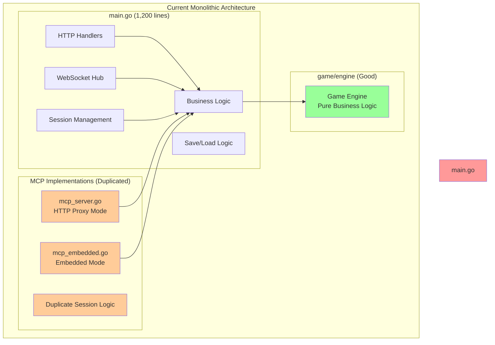
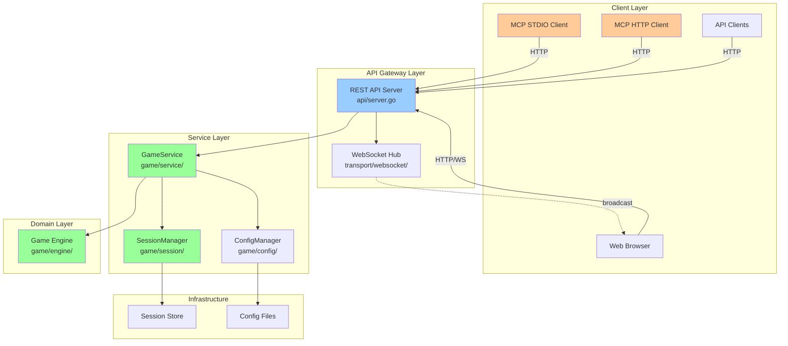
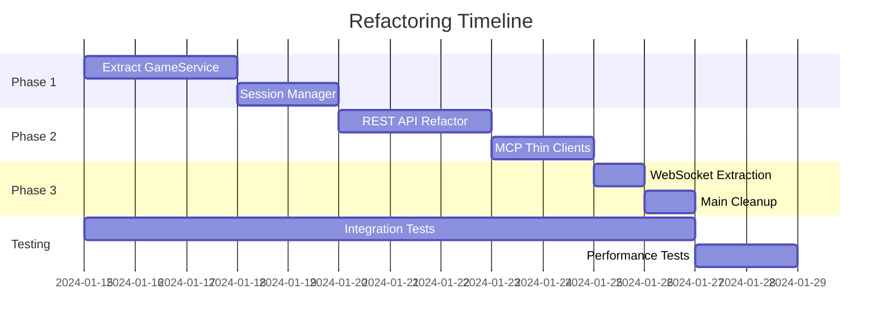

# Architecture Refactoring Diagram

## Current Architecture (BEFORE)



### Current Problems
- 🔴 **Mixed Concerns:** HTTP transport mixed with business logic
- 🔴 **Code Duplication:** 3 implementations of bulk moves, session management
- 🔴 **Global State:** Breaks encapsulation principles
- 🔴 **Tight Coupling:** Transport layers know about business logic
- 🟢 **Engine Package:** Well-designed and isolated (keep as-is)

---

## Target Architecture (AFTER)



### Clean Separation of Concerns

#### **Transport Layer** (Blue)
```go
// api/server.go - Thin HTTP handler
func (s *APIServer) HandleMove(w http.ResponseWriter, r *http.Request) {
    sessionID := mux.Vars(r)["id"]
    var req MoveRequest
    json.NewDecoder(r.Body).Decode(&req)

    // Delegate to service
    result, err := s.service.Move(sessionID, req.Direction, req.Reset)

    // Handle response
    respondJSON(w, result)
}
```

#### **Service Layer** (Green)
```go
// game/service/game_service.go - Business logic
type GameService interface {
    CreateSession(configName string) (*Session, error)
    Move(sessionID, direction string, reset bool) (*MoveResult, error)
    BulkMove(sessionID string, moves []string, reset bool) (*BulkMoveResult, error)
    GetGameState(sessionID string) (*GameState, error)
}
```

#### **MCP as Thin Clients** (Orange)
```go
// mcp/client.go - Just forwards to REST API
func (c *MCPClient) HandleMove(ctx context.Context, req mcp.Request) (*mcp.Result, error) {
    // Simply call REST API
    resp, err := c.httpClient.Post("/api/sessions/{id}/move", req.Params)
    return formatResponse(resp), err
}
```

---

## Directory Structure Transformation

### Before (Messy)
```
statefullgame/
├── main.go              (1,200 lines - everything mixed)
├── mcp_server.go        (994 lines - duplicate logic)
├── mcp_embedded.go      (1,037 lines - duplicate logic)
├── cli.go               (545 lines)
└── game/
    └── engine/          (good - keep as is)
```

### After (Clean)
```
statefullgame/
├── main.go              (<200 lines - orchestration only)
├── api/
│   └── server.go        (REST API routes)
├── game/
│   ├── engine/          (existing - unchanged)
│   ├── service/         (NEW - business logic)
│   │   ├── game_service.go
│   │   └── game_service_test.go
│   └── session/         (NEW - session management)
│       ├── manager.go
│       └── manager_test.go
├── transport/
│   ├── http/            (HTTP handlers)
│   ├── websocket/       (WebSocket hub)
│   └── mcp/             (MCP clients)
│       ├── client.go
│       └── server.go
└── cmd/
    └── cli.go           (CLI commands)
```

---

## Data Flow Examples

### Move Operation - Current vs Target

#### Current (Tangled)
```
HTTP Request → main.go handler → mixed business logic → engine → response
MCP Request → mcp_embedded.go → duplicate business logic → engine → response
```

#### Target (Clean)
```
HTTP Request → API Server → GameService → Engine → response
MCP Request → HTTP Client → API Server → GameService → Engine → response
```

### Session Creation - Current vs Target

#### Current (Duplicated)
```
main.go: getOrCreateSession() + createSessionWithConfig()
mcp_embedded.go: duplicate session creation logic
mcp_server.go: calls HTTP but has own session logic
```

#### Target (Single Source)
```
All paths → SessionManager.Create() → single implementation
```

---

## Benefits Summary

| Metric | Current | Target | Improvement |
|--------|---------|--------|-------------|
| Total LOC | ~6,000 | ~3,600 | -40% |
| main.go size | 1,200 lines | <200 lines | -83% |
| Duplicate implementations | 3 | 0 | -100% |
| Test coverage | ~40% | >80% | +100% |
| Cyclomatic complexity | >15 | <10 | -33% |
| New feature time | 2 days | <1 day | -50% |

---

## Migration Path Visualization



---

## API Contract Preservation

### Existing Endpoints (Preserved)
```
POST   /api/sessions                 → Create session
GET    /api/sessions/{id}            → Get session state
POST   /api?sessionId={id}           → Move (backward compat)
POST   /api/sessions/{id}/move       → Move (new clean route)
POST   /api/sessions/{id}/bulk-move  → Bulk moves
POST   /api/sessions/{id}/reset      → Reset game
GET    /api/sessions/{id}/history    → Move history
GET    /api/configs                  → List configurations
WS     /ws?sessionId={id}            → WebSocket connection
```

### MCP Tools (Unchanged Interface)
```yaml
tools:
  - game_state(session_id)
  - move(session_id, direction, reset?)
  - bulk_move(session_id, moves[], reset?)
  - reset_game(session_id)
  - create_session(config_name?)
  - list_sessions()
```

This architecture ensures **zero breaking changes** while achieving **massive internal improvements**!