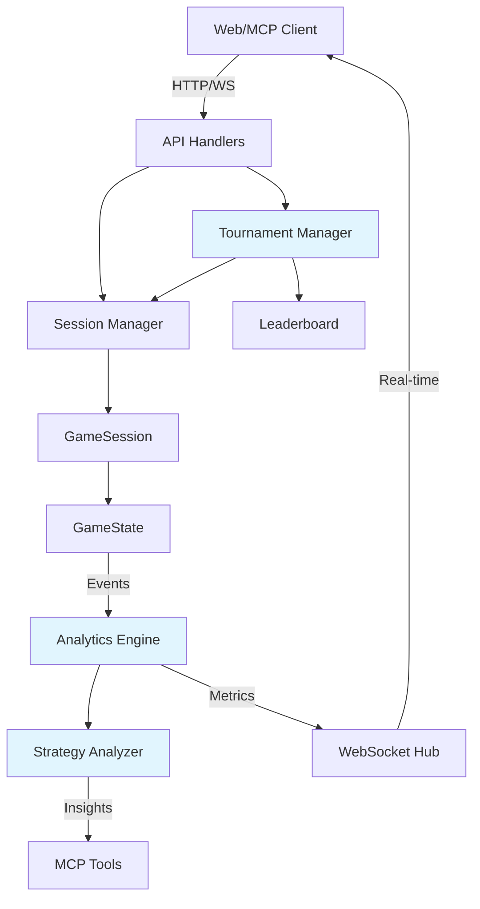

# Tesla Road Trip Game - Brownfield Enhancement Architecture

## Introduction

This document outlines the architectural approach for enhancing the Tesla Road Trip Game with comprehensive multi-session management, MCP integration, and advanced AI gameplay capabilities. Its primary goal is to serve as the guiding architectural blueprint for AI-driven development of new features while ensuring seamless integration with the existing system.

### Relationship to Existing Architecture

This document supplements the existing project architecture by defining how new components integrate with current systems. Where conflicts arise between new and existing patterns, this document provides guidance on maintaining consistency while implementing enhancements.

### Existing Project Analysis

#### Current Project State
- **Primary Purpose:** Grid-based game server where players control a Tesla to collect parks while managing battery
- **Current Tech Stack:** Go 1.16+, Gorilla WebSocket, HTML/CSS/JS frontend, JSON configuration system
- **Architecture Style:** Monolithic single-file architecture with embedded templates, multi-session management, WebSocket hub pattern
- **Deployment Method:** Single binary deployment with embedded assets, command-line configuration

#### Available Documentation
- README.md - User-facing game documentation
- README_MCP.md - MCP server integration guide
- PROJECT_DOCUMENTATION.md - Comprehensive technical documentation
- CLAUDE.md files - AI assistant guidance and strategies

#### Identified Constraints
- Single-file architecture (main.go) requires careful integration to avoid complexity
- Thread-safe session management using sync.RWMutex
- WebSocket buffer size limitations (256 bytes)
- Grid size constraints (5x5 to 50x50)
- Maximum bulk moves limited to 50 operations

### Change Log

| Change | Date | Version | Description | Author |
|--------|------|---------|-------------|--------|
| Initial | 2025-01-10 | v1.0 | Created brownfield architecture for game enhancements | BMad Orchestrator |

## Enhancement Scope and Integration Strategy

### Enhancement Overview
- **Enhancement Type:** Feature Extension & API Enhancement
- **Scope:** Expanding existing multi-session game server with advanced AI integration capabilities, persistent session management, and enhanced analytics
- **Integration Impact:** Low-to-Medium - Leveraging existing patterns while adding new capabilities

### Integration Approach
- **Code Integration Strategy:** Extend existing structs (GameState, GameSession) with new fields; add new handler functions following existing HTTP handler patterns; maintain single-file architecture until complexity justifies refactoring
- **Database Integration:** Continue file-based persistence pattern with enhanced JSON serialization for new features; potential future migration to embedded database (BoltDB/BadgerDB) for performance
- **API Integration:** Add new endpoints following existing RESTful patterns (/api/analytics, /api/tournaments); extend MCP tools while maintaining HTTP proxy architecture
- **UI Integration:** Enhance existing HTML template with new dashboard components; maintain WebSocket real-time update pattern for new features

### Compatibility Requirements
- **Existing API Compatibility:** All current endpoints remain unchanged; new features use additive API design (new endpoints, optional parameters)
- **Database Schema Compatibility:** New fields in GameState/GameSession are optional with sensible defaults; existing save files remain loadable
- **UI/UX Consistency:** New UI components follow existing Tesla-themed design system; maintain current keyboard controls and interaction patterns
- **Performance Impact:** Session cleanup goroutine to prevent memory growth; efficient JSON streaming for large session lists; maintain sub-100ms API response times

## Tech Stack Alignment

### Existing Technology Stack

| Category | Current Technology | Version | Usage in Enhancement | Notes |
|----------|-------------------|---------|---------------------|-------|
| Language | Go | 1.16+ | Primary language for all enhancements | Maintain version compatibility |
| WebSocket | Gorilla WebSocket | Latest | Real-time session updates, tournament broadcasts | Existing hub pattern extended |
| HTTP Router | net/http (stdlib) | Stdlib | New API endpoints follow existing patterns | No external router needed |
| Serialization | encoding/json | Stdlib | Enhanced save states, analytics data | Streaming for large datasets |
| MCP Integration | mark3labs/mcp-go | Latest | Extended tool set for AI agents | Maintain proxy architecture |
| Frontend | HTML/CSS/JS | ES6+ | Dashboard enhancements, new visualizations | Embedded in binary |
| Configuration | JSON files | - | New config options for tournaments, analytics | Backward compatible |
| Testing | Go testing package | Stdlib | Unit and integration tests | Extend existing test patterns |

### New Technology Additions

| Technology | Version | Purpose | Rationale | Integration Method |
|------------|---------|---------|-----------|-------------------|
| sync.Map | Stdlib | Concurrent session metrics | Better performance than mutex for read-heavy operations | Drop-in replacement for specific use cases |
| time.Ticker | Stdlib | Scheduled session cleanup | Prevent memory leaks from abandoned sessions | Goroutine in main startup |
| crypto/sha256 | Stdlib | Session fingerprinting | Track unique gameplay patterns for analytics | Hash game states for comparison |

## Data Models and Schema Changes

### New Data Models

#### SessionMetrics
**Purpose:** Track performance metrics and gameplay patterns per session  
**Integration:** Embedded in GameSession struct as optional field

**Key Attributes:**
- `MovesPerMinute`: float64 - Movement efficiency metric
- `ChargerUtilization`: float64 - Percentage of available chargers used
- `OptimalPathDeviation`: int - Steps deviation from optimal solution
- `SessionDuration`: time.Duration - Total active gameplay time
- `PeakBatteryUsage`: int - Highest battery level achieved

**Relationships:**
- **With Existing:** One-to-one with GameSession
- **With New:** Feeds into TournamentResult aggregations

#### TournamentState
**Purpose:** Manage multi-session competitive gameplay  
**Integration:** New top-level struct managing multiple GameSessions

**Key Attributes:**
- `TournamentID`: string - Unique tournament identifier
- `Participants`: map[string]*GameSession - Active tournament sessions
- `Leaderboard`: []LeaderboardEntry - Sorted rankings
- `Config`: TournamentConfig - Rules and constraints
- `StartTime`: time.Time - Tournament start timestamp

**Relationships:**
- **With Existing:** Orchestrates multiple GameSession instances
- **With New:** Generates CompetitionAnalytics

### Schema Integration Strategy

**Database Changes Required:**
- **New Tables:** None (maintaining file-based approach)
- **Modified Tables:** None (using struct composition)
- **New Indexes:** Session ID index in memory map for O(1) lookups
- **Migration Strategy:** Lazy migration - old saves load with zero-valued new fields

**Backward Compatibility:**
- New fields use `omitempty` JSON tags - old saves remain valid
- Default values provide sensible behavior for unmigrated data
- Version field added to saves for future migration paths

## Component Architecture

### New Components

#### Analytics Engine
**Responsibility:** Collect, process, and analyze gameplay metrics across all sessions to provide insights for AI training and player improvement  
**Integration Points:** Hooks into GameState.processMove(), WebSocket hub for real-time metrics, new /api/analytics endpoint

**Key Interfaces:**
- `CollectMetrics(session *GameSession)` - Gather session data
- `GenerateInsights() AnalyticsReport` - Process aggregated metrics
- `StreamMetrics(ws *websocket.Conn)` - Real-time analytics feed

**Dependencies:**
- **Existing Components:** GameSession, GameState, WebSocket Hub
- **New Components:** SessionMetrics model

**Technology Stack:** Pure Go with sync.Map for concurrent access, time.Ticker for periodic aggregation

#### Tournament Manager
**Responsibility:** Orchestrate competitive multi-session gameplay, manage leaderboards, enforce tournament rules  
**Integration Points:** Creates multiple GameSessions, extends session manager, new /api/tournaments endpoints

**Key Interfaces:**
- `CreateTournament(config TournamentConfig) *TournamentState`
- `JoinTournament(tournamentID, sessionID string) error`
- `UpdateLeaderboard(tournamentID string)`

**Dependencies:**
- **Existing Components:** Session management, GameConfig loader
- **New Components:** TournamentState, Leaderboard system

**Technology Stack:** Go channels for event coordination, sync.RWMutex for concurrent access

#### AI Strategy Analyzer
**Responsibility:** Analyze successful gameplay patterns and generate strategy recommendations for AI agents  
**Integration Points:** Reads move history, interfaces with MCP tools, provides hints via new API

**Key Interfaces:**
- `AnalyzeStrategy(history []MoveHistoryEntry) StrategyReport`
- `SuggestNextMove(state *GameState) []MoveSuggestion`
- `CompareStrategies(sessions []*GameSession) Comparison`

**Dependencies:**
- **Existing Components:** MoveHistory, GameState pathfinding
- **New Components:** Analytics Engine data

**Technology Stack:** Graph algorithms for pathfinding analysis, pattern matching for strategy detection

### Component Interaction Diagram



## API Design and Integration

### API Integration Strategy
- **API Integration Strategy:** Extend existing RESTful patterns with new endpoints; maintain backward compatibility through versioning headers; follow existing JSON response structures
- **Authentication:** Continue session-based approach with optional API key support for automated agents
- **Versioning:** Use Accept header versioning (application/vnd.tesla.v2+json) for breaking changes; default to v1 behavior

### New API Endpoints

#### Analytics Endpoint
- **Method:** GET
- **Endpoint:** `/api/analytics`
- **Purpose:** Retrieve gameplay analytics and insights
- **Integration:** Aggregates data from all sessions using Analytics Engine

##### Request
```json
{
  "session_id": "a3x7",
  "from": "2025-01-01T00:00:00Z",
  "to": "2025-01-31T23:59:59Z",
  "metrics": ["efficiency", "strategy", "patterns"]
}
```

##### Response
```json
{
  "summary": {
    "total_sessions": 156,
    "avg_completion_time": 245,
    "success_rate": 0.73
  },
  "top_strategies": [
    {"name": "corridor_navigation", "usage": 0.45, "success_rate": 0.89},
    {"name": "charger_hopping", "usage": 0.31, "success_rate": 0.67}
  ],
  "insights": [
    "Players who visit chargers proactively have 34% higher success rate",
    "Optimal path length for classic config is 47 moves"
  ]
}
```

#### Tournament Endpoints
- **Method:** POST
- **Endpoint:** `/api/tournaments`
- **Purpose:** Create and manage competitive gameplay sessions
- **Integration:** Uses Tournament Manager to orchestrate multiple sessions

##### Request
```json
{
  "action": "create",
  "config": {
    "name": "Speed Challenge",
    "max_participants": 10,
    "time_limit": 300,
    "config_name": "classic",
    "scoring": "time_based"
  }
}
```

##### Response
```json
{
  "tournament_id": "trn_x9k2",
  "status": "waiting_for_players",
  "join_url": "/api/tournaments/trn_x9k2/join",
  "participants": 0,
  "max_participants": 10,
  "starts_at": "2025-01-15T10:00:00Z"
}
```

#### Strategy Suggestion Endpoint
- **Method:** POST
- **Endpoint:** `/api/strategy/suggest`
- **Purpose:** Provide AI-powered move suggestions based on current state
- **Integration:** Uses Strategy Analyzer to recommend optimal moves

##### Request
```json
{
  "session_id": "a3x7",
  "depth": 3,
  "strategy": "optimal"
}
```

##### Response
```json
{
  "suggestions": [
    {
      "move": "up",
      "score": 0.92,
      "reasoning": "Moves toward nearest park with charger nearby",
      "risk": "low"
    },
    {
      "move": "right",
      "score": 0.71,
      "reasoning": "Direct path but no charging options",
      "risk": "medium"
    }
  ],
  "board_analysis": {
    "reachable_parks": 3,
    "nearest_charger": {"x": 7, "y": 5, "distance": 4},
    "battery_sufficiency": true
  }
}
```

## Source Tree Integration

### Existing Project Structure
```plaintext
statefullgame/
├── main.go                 # Core game server (monolithic)
├── mcp_server.go          # MCP proxy server
├── cli.go                 # CLI command handling
├── *_test.go              # Test files
├── configs/               # Game configurations
├── static/             # HTML templates
├── saves/                 # Saved games
└── .bmad-core/           # BMad framework
```

### New File Organization
```plaintext
statefullgame/
├── main.go                        # Core game server with embedded new features
├── mcp_server.go                  # Extended with new MCP tools
├── cli.go                         # Additional CLI commands
├── analytics.go                   # NEW: Analytics Engine component
├── tournament.go                  # NEW: Tournament Manager component
├── strategy.go                    # NEW: AI Strategy Analyzer
├── analytics_test.go              # NEW: Analytics tests
├── tournament_test.go             # NEW: Tournament tests
├── strategy_test.go               # NEW: Strategy tests
├── configs/                       # Existing folder with additions
│   ├── tournaments/               # NEW: Tournament configurations
│   │   ├── speed_run.json
│   │   └── endurance.json
│   └── [existing configs]
├── templates/                     # Existing folder with additions
│   ├── game.html                  # Existing file
│   ├── analytics.html             # NEW: Analytics dashboard
│   └── tournament.html            # NEW: Tournament interface
├── saves/                         # Existing folder with additions
│   ├── sessions/                  # NEW: Organized session saves
│   └── tournaments/               # NEW: Tournament state saves
└── docs/                          # NEW: Documentation folder
    ├── architecture.md            # This document
    └── api/                       # NEW: API documentation
        └── v2-endpoints.md
```

### Integration Guidelines
- **File Naming:** Follow existing snake_case pattern (analytics.go, not Analytics.go)
- **Folder Organization:** New feature folders under existing structure; avoid deep nesting
- **Import/Export Patterns:** Package-level functions for component interfaces; avoid circular dependencies

## Infrastructure and Deployment Integration

### Existing Infrastructure
- **Current Deployment:** Single Go binary with embedded assets, command-line flags for configuration
- **Infrastructure Tools:** go build toolchain, optional Docker containerization
- **Environments:** Local development, single-server production deployment

### Enhancement Deployment Strategy
- **Deployment Approach:** Maintain single-binary deployment; new features embedded in same executable; backward-compatible upgrades with zero downtime via graceful restart
- **Infrastructure Changes:** None required - enhancements use existing ports and resources; optional memory limit increase for tournament hosting
- **Pipeline Integration:** Extend existing build script to run new test suites; add analytics endpoint health checks

### Rollback Strategy
- **Rollback Method:** Binary versioning with symlink switching; keep last 3 versions for instant rollback; session data remains compatible across versions
- **Risk Mitigation:** Feature flags for new components (ENABLE_ANALYTICS, ENABLE_TOURNAMENTS); gradual rollout with monitoring
- **Monitoring:** New metrics endpoints (/health/analytics, /health/tournaments); log aggregation for error tracking; session memory usage alerts

### Deployment Commands
```bash
# Build with version embedding
go build -ldflags "-X main.Version=v2.0.0" -o statefullgame-v2.0.0

# Deploy with zero downtime
ln -sfn statefullgame-v2.0.0 statefullgame-current
kill -USR2 $(cat statefullgame.pid)  # Graceful restart

# Rollback if needed
ln -sfn statefullgame-v1.9.0 statefullgame-current
kill -USR2 $(cat statefullgame.pid)
```

## Coding Standards and Conventions

### Existing Standards Compliance
- **Code Style:** Standard Go formatting via gofmt; clear variable names (gameState not gs); consistent receiver names
- **Linting Rules:** go vet and golint compliance; no unused variables; proper error handling
- **Testing Patterns:** Table-driven tests; test files alongside implementation; descriptive test names (TestGameEngine_MovePlayer_ValidMove)
- **Documentation Style:** Package-level comments; inline documentation for complex logic; README files for user-facing docs

### Enhancement-Specific Standards
- **Analytics Collection:** All metrics collection must be non-blocking using goroutines; metrics structs must use sync.RWMutex for concurrent access
- **Tournament Orchestration:** Use channels for inter-session communication; tournament events must be idempotent for replay capability
- **Strategy Analysis:** Algorithm complexity must be documented (O(n) notation); heuristics must include accuracy percentages

### Critical Integration Rules
- **Existing API Compatibility:** New endpoints must not modify existing endpoint behavior; use optional query parameters for new features on existing endpoints
- **Database Integration:** New JSON fields must use omitempty tags; save file version field required for migration compatibility
- **Error Handling:** Follow existing error return pattern (error as last return value); wrap errors with context using fmt.Errorf
- **Logging Consistency:** Use existing log format: [timestamp] [component] [level] message; new components get unique prefixes (ANALYTICS:, TOURNAMENT:)

### Code Examples
```go
// GOOD: Follows existing patterns
func (tm *TournamentManager) CreateTournament(config TournamentConfig) (*TournamentState, error) {
    if err := config.Validate(); err != nil {
        return nil, fmt.Errorf("invalid tournament config: %w", err)
    }
    // Implementation
}

// BAD: Breaks conventions
func CreateTournament(c TournamentConfig) *TournamentState {
    // Missing error handling, poor naming
}
```

## Testing Strategy

### Integration with Existing Tests
- **Existing Test Framework:** Go standard testing package with table-driven tests
- **Test Organization:** Test files alongside implementation (*_test.go pattern)
- **Coverage Requirements:** Maintain existing 70%+ coverage; critical paths require 90%+

### New Testing Requirements

#### Unit Tests for New Components
- **Framework:** Go testing package (consistent with existing)
- **Location:** analytics_test.go, tournament_test.go, strategy_test.go
- **Coverage Target:** 80% for new components
- **Integration with Existing:** Reuse existing test helpers (initTestGame(), mockConfig())

#### Integration Tests
- **Scope:** End-to-end tournament flow; analytics data pipeline; strategy suggestions with real game states
- **Existing System Verification:** Ensure tournaments don't affect non-tournament sessions; verify analytics don't impact game performance
- **New Feature Testing:** Multi-session tournament coordination; real-time analytics streaming; strategy accuracy validation

#### Regression Testing
- **Existing Feature Verification:** Run full existing test suite with new components enabled; verify save/load compatibility with old files
- **Automated Regression Suite:** Add to test-api.sh script; include backwards compatibility checks
- **Manual Testing Requirements:** Tournament UI interaction; analytics dashboard visualization; strategy suggestion UX

### Test Examples
```go
// analytics_test.go
func TestAnalyticsEngine_CollectMetrics_Concurrent(t *testing.T) {
    engine := NewAnalyticsEngine()
    sessions := createTestSessions(100)
    
    var wg sync.WaitGroup
    for _, session := range sessions {
        wg.Add(1)
        go func(s *GameSession) {
            defer wg.Done()
            engine.CollectMetrics(s)
        }(session)
    }
    wg.Wait()
    
    metrics := engine.GetAggregateMetrics()
    assert.Equal(t, 100, metrics.TotalSessions)
    assert.True(t, metrics.AvgMovesPerMinute > 0)
}

// tournament_test.go  
func TestTournament_LeaderboardConsistency(t *testing.T) {
    tournament := createTestTournament()
    
    // Simulate concurrent game completions
    results := simulateTournamentGames(tournament, 10)
    
    leaderboard := tournament.GetLeaderboard()
    assert.Equal(t, 10, len(leaderboard))
    assert.True(t, sort.IsSorted(ByScore(leaderboard)))
}
```

## Security Integration

### Existing Security Measures
- **Authentication:** Session-based with secure random IDs (crypto/rand)
- **Authorization:** Session isolation ensures users can only access their own games
- **Data Protection:** No sensitive data stored; game states are non-confidential
- **Security Tools:** Go standard library crypto packages; no external security dependencies

### Enhancement Security Requirements
- **New Security Measures:** Rate limiting for analytics API (100 req/min); tournament join tokens to prevent unauthorized access; strategy API requires session ownership validation
- **Integration Points:** Analytics must not leak cross-session data; tournament spectator mode with read-only access; strategy suggestions filtered by session permissions
- **Compliance Requirements:** GDPR-compliant anonymous analytics; no PII collection; optional analytics opt-out flag

### Security Testing
- **Existing Security Tests:** Session hijacking prevention tests; concurrent access race condition tests
- **New Security Test Requirements:** Tournament isolation tests; analytics data leakage tests; rate limiting effectiveness validation
- **Penetration Testing:** Session enumeration resistance; tournament manipulation attempts; analytics API abuse scenarios

### Security Implementation
```go
// Rate limiting for analytics
type RateLimiter struct {
    requests map[string][]time.Time
    mu       sync.RWMutex
    limit    int
    window   time.Duration
}

func (rl *RateLimiter) Allow(clientIP string) bool {
    rl.mu.Lock()
    defer rl.mu.Unlock()
    
    now := time.Now()
    windowStart := now.Add(-rl.window)
    
    // Clean old requests
    validRequests := []time.Time{}
    for _, t := range rl.requests[clientIP] {
        if t.After(windowStart) {
            validRequests = append(validRequests, t)
        }
    }
    
    if len(validRequests) >= rl.limit {
        return false
    }
    
    rl.requests[clientIP] = append(validRequests, now)
    return true
}

// Tournament access control
func (tm *TournamentManager) JoinTournament(tournamentID, sessionID, joinToken string) error {
    tournament := tm.tournaments[tournamentID]
    if tournament == nil {
        return ErrTournamentNotFound
    }
    
    if !tournament.ValidateJoinToken(joinToken) {
        return ErrInvalidToken
    }
    
    // Prevent session reuse across tournaments
    if tm.IsSessionInAnyTournament(sessionID) {
        return ErrSessionAlreadyInTournament
    }
    
    return tournament.AddParticipant(sessionID)
}
```

## Next Steps

### Story Manager Handoff

To begin implementing the Tesla Road Trip Game enhancements outlined in this architecture document:

1. **Reference Documents:** Start with this architecture (docs/architecture.md) and existing PROJECT_DOCUMENTATION.md
2. **Key Integration Requirements:** 
   - Maintain backward compatibility with existing save files
   - Preserve thread-safe session management patterns
   - Follow monolithic architecture until complexity demands refactoring
3. **Existing System Constraints:**
   - Single-file main.go structure works well for current scope
   - WebSocket buffer limited to 256 bytes
   - Maximum 50 bulk moves per request
4. **First Story to Implement:** 
   - "Add Analytics Engine Foundation" - Create basic metrics collection without UI
   - Integration checkpoint: Verify no performance impact on gameplay
5. **System Integrity:** Run full test suite after each story; monitor memory usage with concurrent sessions

### Developer Handoff

For developers beginning implementation:

1. **Architecture & Standards:** Review this document and existing patterns in main.go; follow gofmt and existing error handling patterns
2. **Integration Requirements:**
   - New structs compose with existing GameSession/GameState
   - Use sync.RWMutex for concurrent access patterns (matching existing)
   - JSON fields must include `omitempty` tags
3. **Key Technical Decisions:**
   - Start with analytics.go as first separate file when needed
   - Use channels for tournament event coordination
   - Implement feature flags (ENABLE_ANALYTICS) for safe rollout
4. **Compatibility Requirements:**
   - Test with saves from configs/ directory
   - Verify existing API endpoints remain unchanged
   - Run regression tests: `./test-api.sh`
5. **Implementation Sequence:**
   - Phase 1: Analytics engine (passive observation)
   - Phase 2: Tournament manager (reuses sessions)
   - Phase 3: Strategy analyzer (builds on analytics data)
   - Phase 4: UI enhancements 

### Immediate Actions
1. Create feature branch: `git checkout -b feature/game-enhancements`
2. Add version field to GameState struct for migration support
3. Implement basic analytics collection in processMove()
4. Create analytics_test.go with concurrent collection tests
5. Update test-api.sh with new endpoint verification

---

## Summary

This Brownfield Architecture document provides a comprehensive blueprint for enhancing the Tesla Road Trip Game while respecting its elegant existing design. The phased approach ensures stability while adding powerful new capabilities:

- **Analytics Engine** for gameplay insights and AI training
- **Tournament System** for competitive multi-session play  
- **Strategy Analyzer** for AI move suggestions
- **Maintained Simplicity** through incremental complexity

The architecture preserves the project's core strengths - single binary deployment, minimal dependencies, and clean code structure - while enabling sophisticated new features that enhance both human and AI gameplay experiences.
